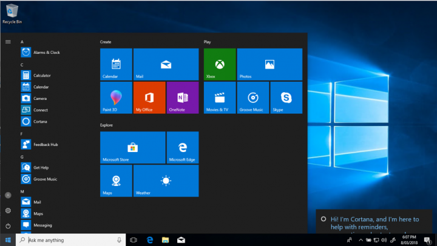
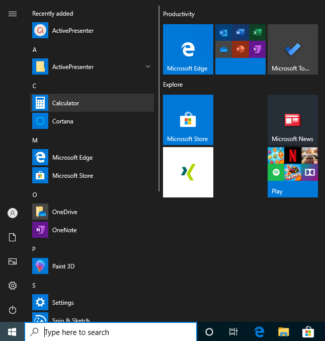
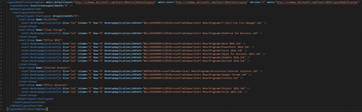

+++
title = "Azure Virtual Desktop - Windows 10 Start menu optimization guide"
image = "title.png"
date = 2020-07-02T16:56:47+06:00
draft = false
author = "Patrick Koehler"
tags = ["Azure Virtual Desktop", "Azure"]
categories = ["Azure Virtual Desktop", "Windows"]
description = "This blog is focused on enhancing the User Experience in Azure Virtual Desktop for both end-users and admins, leveraging the capabilities of the WVD Spring Release. He dives into configuring the Windows 10 Start Menu and Taskbar, providing detailed insights and tips for optimization, empowering administrators to tailor the environment to meet their users' needs effectively."
+++

Hi everybody it´s Patrick again with another blog post!
It´s been busy weeks since my last article about Host Pool Automation (part 3), where I´ve shared with you my first Automation Scaling script, check it out if you´re interested how you can get started with automating your WVD session hosts to save costs!

But this week I´m going to start a new article series, focusing on increasing the User Experience in Windows Virtual Desktop for end-users as well as for admins!

Since WVD Spring Release is available in public preview I was searching for the state of the art User Experience and finally I came to the conclusion that every environment has its own signature so that you can´t summarize and give the “final answer” to all usability questions, but at least we can try to optimize the environment, to make our end-users curious about what they can do in WVD, especially with the new Windows 10 Multi-Session 2004 version!

## Chapter 1: Windows 10 Startmenu and Taskbar: The basics

The Windows 10 startmenu or taskbar is the place in Windows to consolidate all installed applications on the system and to provide an easy to use navigation point while providing direct shortcuts to the applications without directly impacting the application installation.

Customizing the Windows 10 startmenu and taskbar is possible since the release of version 1607.

By default, a Windows 10 startmenu provides the following view, while opening it:



While having a deeper look at the startmenu itself, we can separate it into the following areas:


* Recently Added: The place that displays, which applications have been installed recently
* Most used: A time-based consolidation, which presents a view of the most used applications on the system
* User tile: Shows the avatar of the user and allows to Change Account settings (for the logged-on user), Lock the system, Sign Out from the system
* Suggestions: Not necessary for enterprise usage. Most likely advertisement of Microsoft Store Apps.
* All Apps: Shows a list of all applications within the startmenu
* Power: Normally allows you to shut down, restart, sleep – but in Windows Virtual Desktop you only have the possibility to disconnect the session from the end-user perspective.
* Start layout: Can be separated into several groups, which include Tiles to start the applications. Tiles can be static (icon) or dynamic (animated). You can pin apps and folders to be started.

<b>%AppData%\Microsoft\Windows\Start Menu\Programs</b>

In here you can find the folders represented in your startmenu while viewing “All Apps”.

To review the location for default users in your environment and to review, where the default icons and application shortcuts are coming from, please find the location for the “all user startmenu”:

<b> %ProgramData%\Microsoft\Windows\Start Menu\Programs. </b>

Finally the startmenu combines both locations and represents the results in the users startmenu. 

The important startmenu rules

To get started with startmenu modifications you need to have in mind, that Microsoft has specific rules on how the whole background process around these startmenus are working, please find them here:


### Indexiation!
As you now know, the startmenu combines the both avalable locations from the user´s startmenu location in the profile with the one available for all users on the local C: drive.

There is a kind of indexiation process behind the scenes which identifies the existance of the same shortcut within the user´s profile and keeps only one version. This means: You cannot have two copies of the same EXE file in the startmenu!


### The emptier the folder.. the less will be displayed..
If you´re managing application folders within your startmenu and you have no shortcuts within a specified folder, it wont be displayed!


### The startmenu is NO PORSCHE!
Very important to keep in mind is, when you do changes to the startmenu or folders, in most cases it requires some time to be applied. In some cases even a re-login to the system!

### Troubleshooting!
I remember my early days in IT, when my colleagues told me to check the event viewer for the exact error messages. If you see that there is an error related to the start menu or taskbar please find the appropriate log files here: Event Viewer > Applications and Services Log > Microsoft > Windows > ShellCommon-StartLayoutPopulation > Operational

## Chapter 2: Configure the startmenu

There are a lot of possibilities given to optimize the startmenu to your end-users needs! Beginning from the installation of new software over the deinstallation of Microsoft´s built-in applications (Appx) to the configuration of the visual setting and groupings of the startmenu. In this section you will learn to cleanup the startmenu and free it from consumer experiences and finally adapt it to your needs while respecting best practices and lessons learned from the past years.

### Remove Consumer Experience Applications

Removing the Consumer Experience Applications should always be the first start of optimizing Windows 10 to prevent, that our users are utilizing applications which aren´t supporting the productivity.

If you need to remove more application or just wanted to know, which AppX applications are installed by default, start a PowerShell as Administrator and type:

```powershell
Get-AppxPackage | ft Name
```

Here is a list of applications, I usually remove from the golden image by default:

```powershell
Microsoft.XboxSpeechToTextOverlay
Microsoft.OneConnect
Microsoft.WindowsFeedbackHub
Microsoft.windowscommunicationsapps
Microsoft.BingWeather
Microsoft.MicrosoftOfficeHub
Microsoft.XboxIdentityProvider
Microsoft.MicrosoftSolitaireCollection
Microsoft.MicrosoftStickyNotes
Microsoft.MSPaint
Microsoft.People
Microsoft.Print3D
Microsoft.WindowsCamera
Microsoft.Windows.Photos
Microsoft.MixedReality.Portal
Microsoft.Xbox.TCUI
Microsoft.ScreenSketch
Microsoft.Messaging
Microsoft.SkypeApp
Microsoft.XboxApp
Microsoft.GetHelp
Microsoft.ZuneMusic
Microsoft.YourPhone
Microsoft.WindowsAlarms
Microsoft.WindowsCalculator
Microsoft.ZuneVideo
Microsoft.XboxGameOverlay
Microsoft.XboxGamingOverlay
Microsoft.WindowsMaps
Microsoft.WindowsSoundRecorder
Microsoft.Office.OneNote
Microsoft.Getstarted
Microsoft.Microsoft3Dviewer
```

To simply remove these applications you can also just run the following Powershell Script in your Windows 10 environment:

```powershell
$appxpackage = "Microsoft.3DBuilder,Microsoft.Getstarted,Microsoft.MicrosoftOfficeHub,Microsoft.MicrosoftSolitaireCollection,Microsoft.People,Microsoft.SkypeApp,Microsoft.WindowsCommunicationsApps,Microsoft.XboxApp,Microsoft.ZuneMusic,Microsoft.ZuneVideo,Microsoft.BingFinance,Microsoft.BingNews,Microsoft.BingSports,Microsoft.BingWeather,Microsoft.Windows.Photos,Microsoft.WindowsCamera,Microsoft.WindowsMaps,Microsoft.YourPhone,Microsoft.WindowsSoundRecorder,Microsoft.WindowsAlarms,Microsoft.GetHelp, Microsoft.Microsoft3Dviewer,Microsoft.Messaging, Microsoft.MixedReality.Portal, Microsoft.WindowsFeedbackHub, Microsoft.Wallet, Microsoft.Print3D,"
$appxpackage=$appxpackage.Split(",")
foreach ($appx in $appxpackage) {Get-AppxPackage $appx -Allusers | Remove-AppxPackage}
```



You will immediately identify, that the applications mentioned above are removed for all users of the system, meaning that future users in our WVD environment wont get those applications installed. But you might wonder, why we are able to see still some consumer applications in the StartMenu?

This is something related to the Windows 10 version you are using (in my example for testing purposes Win10 Pro), where you can disable the usage of consumer apps easily via GPO later on.

The required settings can be defined from the Group Policy Management console of your administrative computer (having the RSAT tools installed), or from any domain controller in your environment.

### Pre-configure shortcuts for deployments

Now it´s most likely the time for you to install your required applications. When this is done you can start creating the startmenu with the presets you want to give your endusers. You can do this in multiple ways:

* Drag&Drop the Shortcuts into the StartMenu
* Right-Click on a Shortcut “Pin to Start”
* Directly into an XML file for the very manual approach

My tip: Do it with Drag&Drop and the Pinning method first!

Now let´s start removing not required application shortcuts by performing a right-click on the tile and select: “Unpin folder from Start”. 

We do this for all our applications and start adding the new tiles by searching them in the StartMenu, performing a right-click and selecting: “Pin to Start”.

By hovering over the name of the group, you can even modify it here:


In my example I specify the group name for my end users, that even the guy with less IT experience knows what these apps are about – hopefully 😉

Finally the startmenu can look like this:

%ScreenShot WVD Environment%

### User Experience Tips!

One thing that dramatically helps users to understand what they have to do when they finish their working day is to provide them with a dedicated Logoff button in the start menu. Like this the users, at least for my customers, are more willed to perform a clean logoff instead of just closing the session window or performing an unclean disconnect.

To create such a loggoff button, follow these steps:

* Create a new batch file and enter the following line:
shutdown -l -f -t 0
* Save it in a location untouchable for your end users (in my case I´ve created C:\Windows\WVDSupport)
* Create a shortcut and paste it into the startmenu folder: C:\ProgramData\Microsoft\Windows\Start Menu\Programs\Administrative Tools\
* When doing a right click on the shortcut you can change the icon, I´ve selected this one.
* Now reference it via Drag and Drop into the startmenu and export it and follow the steps descripted in chapter 4!

## Chapter 3: Configure the Taskbar

Since the version Windows 10 1607 you have the possibility to remove and pin additional applications to the Taskbar of Windows 10. In our case this is really helpful to pre-define the default settings for our end-users in the WVD environment.


To add new icons to the taskbar, simply drag and drop them from the start menu or perform a right-click > More > Pin to Taskbar

### User Experience Tips!

Don´t forget to pin the Windows Explorer / File Explorer! By default this is not the case but it will drastically improve the user experience.

Just search for the Windows Explorer in your start menu and make a right-click > Pin to taskbar!

## Chapter 4: Provisioning options for Windows Virtual Desktop

For our deployment in WVD it´s really important to know the different ways of deploying the predefined settings to our end users. I will not be able to mention every single option in detail, but I will explain you most likely the pro´s and con´s of each approach and by interest I´m available to guide you through the setup in detail.

Let me quickly present you, which characteristics a Startmenu or Taskbar can have for the end users and how we as administrators can benefit from some settings:

* Mandatory startmenu: A predefined layout that end-users are NOT able to change in any way. It´s completely configured by the administrator and there is no way of removing Tiles or adding new ones
    * Pro´s: Easy administrative effort, as Admins have the full control over what is presented to the end-users
    * Con´s: The users will heavily complain in some cases, because the IT department doesn´t integrate their daily business application
* Partially Customizable startmenu: This allows the administrator to predefine the startlayout and set specific groups to a mandatory state. This means, that certain groups are not modifiable, while other areas can be modified by the end-users.
    * Pro´s: Mandatory applications are always pinned to the startmenu, this allows easy access to mandatory applications everyone needs. Additionally the user can modify and add his / her favorite tools on top of that.
    * Con´s: Administrative effort can be a bit higher, when troubleshooting user interaction mistakes
* Default Start Menu: Enables the predefined settings by the administrators and allows the user to fully optimize and adopt the startmenu
    * Pro´s: Allows the IT department to completely pre-define the startmenu and give the user the full flexibility afterwards
    * Con´s: Need to be implemented in the Golden Image by either importing the Layout via PowerShell or by copying the LayoutModification.xml into the Default User Profile (Explained later)

Let me present you quickly how to setup every of these three possibilities:

### Configure the mandatory startmenu

The first thing, after defining the startmenu is to export it. To do so you must start the Powershell as an administrator and run the following command:

```powershell
Export-StartLayout -Path %UNC Path to your location%\filename.xml
```

The result will be exported as an XML and should look like this:



As you can see, the XML is structured based on the shortcuts you defined in your startmenu layout.

I highly recommend you to have a look at the official Microsoft documentation for more information about, how this XML file is built:
(https://docs.microsoft.com/en-us/windows/configuration/start-layout-xml-desktop)

To make this startlayout finally mandatory, we need to define the XML as StartLayout via Group Policy. To do so, open up the Group Policy Management Console and create a new GPO or edit an existing one:

<b> User Configuration > Administrative Templates > Start Menu and Taskbar > Start Layout </b>

Once applied the startlayout will be enforced for all users, where it applies!

### Configure the partially customizable startmenu

To define a partially customizable startmenu we need to go back to the point, where we have exported our startmenu. As a small reminder, you have to open the PowerShell as Administrator and run:

```powershell
Export-StartLayout -Path %UNC Path to your location%\filename.xml
```

Now you need to open this XML file and define the groups, you want to lock or prevent the user from changing it.

You will see the start of the seciton “DefaultLayoutOverride” in this XML, which needs to be adapted for the usage of partial customizable menus.

To enable that feature just replace this value by: <DefaultLayoutOverride LayoutCustomizationRestrictionType=”OnlySpecifiedGroups”>

Now, all definitions you did in this XML file will become active, once you reimport that file on your golden image or user session.

This can be done by re-importing it via Powershell using this command as Administrator:

Import-StartLayout -LayoutPath \\%UNCToStartLayout%\StartLayout.xml -MountPath c:\
Or by renaming your XML into LayoutModification.xml and place it into the Default user Shell folder:

“C:\Users\Default\AppData\Local\Microsoft\Windows\Shell\LayoutModification.xml”

This will activate the settings for all users, that will be created on that system.

### Configure a Default Start Menu

The last option is to simply export the startmenu as mentioned above and place it into the Shell folder without any modification on the XML file itself!
Please keep in mind that the XML must be named “LayoutModification.xml”, otherwise your process of enabling the default layout will fail!

## Chapter 5: Download the resources

If you want to get my start layout, please find it here to be used for your deployments! Via the tasks descripted in chapter 4 you can adapt it to your individual needs. Please keep in mind that my startlayout requires to work the updated Edge Browser and the installed Office365 ProPlus package.


```xml
<LayoutModificationTemplate xmlns:defaultlayout="http://schemas.microsoft.com/Start/2014/FullDefaultLayout" xmlns:start="http://schemas.microsoft.com/Start/2014/StartLayout" Version="1" xmlns="http://schemas.microsoft.com/Start/2014/LayoutModification">
  <LayoutOptions StartTileGroupCellWidth="6" />
  <DefaultLayoutOverride>
    <StartLayoutCollection>
      <defaultlayout:StartLayout GroupCellWidth="6">
        <start:Group Name="Browsers">
          <start:DesktopApplicationTile Size="2x2" Column="4" Row="0" DesktopApplicationLinkPath="%APPDATA%\Microsoft\Windows\Start Menu\Programs\Accessories\Internet Explorer.lnk" />
          <start:DesktopApplicationTile Size="2x2" Column="0" Row="0" DesktopApplicationLinkPath="%ALLUSERSPROFILE%\Microsoft\Windows\Start Menu\Programs\Microsoft Edge.lnk" />
          <start:DesktopApplicationTile Size="2x2" Column="2" Row="0" DesktopApplicationLinkPath="%ALLUSERSPROFILE%\Microsoft\Windows\Start Menu\Programs\Google Chrome.lnk" />
        </start:Group>
        <start:Group Name="Utilities">
          <start:DesktopApplicationTile Size="2x2" Column="2" Row="0" DesktopApplicationLinkPath="%APPDATA%\Microsoft\Windows\Start Menu\Programs\System Tools\File Explorer.lnk" />
          <start:DesktopApplicationTile Size="1x1" Column="4" Row="0" DesktopApplicationLinkPath="%ALLUSERSPROFILE%\Microsoft\Windows\Start Menu\Programs\Accessories\Snipping Tool.lnk" />
          <start:DesktopApplicationTile Size="1x1" Column="4" Row="1" DesktopApplicationLinkPath="%ALLUSERSPROFILE%\Microsoft\Windows\Start Menu\Programs\Accessories\Quick Assist.lnk" />
          <start:Tile Size="1x1" Column="5" Row="0" AppUserModelID="Microsoft.PPIProjection_cw5n1h2txyewy!Microsoft.PPIProjection" />
          <start:Tile Size="1x1" Column="5" Row="1" AppUserModelID="windows.immersivecontrolpanel_cw5n1h2txyewy!microsoft.windows.immersivecontrolpanel" />
          <start:DesktopApplicationTile Size="2x2" Column="0" Row="0" DesktopApplicationLinkPath="%ALLUSERSPROFILE%\Microsoft\Windows\Start Menu\Programs\Administrative Tools\GaaschTools\Logoff.lnk" />
        </start:Group>
        <start:Group Name="Microsoft 365 ProPlus">
          <start:DesktopApplicationTile Size="2x2" Column="2" Row="2" DesktopApplicationLinkPath="%ALLUSERSPROFILE%\Microsoft\Windows\Start Menu\Programs\PowerPoint.lnk" />
          <start:DesktopApplicationTile Size="2x2" Column="0" Row="0" DesktopApplicationLinkPath="%ALLUSERSPROFILE%\Microsoft\Windows\Start Menu\Programs\Outlook.lnk" />
          <start:DesktopApplicationTile Size="2x2" Column="4" Row="2" DesktopApplicationLinkPath="%ALLUSERSPROFILE%\Microsoft\Windows\Start Menu\Programs\Publisher.lnk" />
          <start:DesktopApplicationTile Size="2x2" Column="2" Row="0" DesktopApplicationLinkPath="%ALLUSERSPROFILE%\Microsoft\Windows\Start Menu\Programs\Word.lnk" />
          <start:DesktopApplicationTile Size="2x2" Column="4" Row="0" DesktopApplicationLinkPath="%ALLUSERSPROFILE%\Microsoft\Windows\Start Menu\Programs\Excel.lnk" />
          <start:DesktopApplicationTile Size="2x2" Column="0" Row="2" DesktopApplicationLinkPath="%ALLUSERSPROFILE%\Microsoft\Windows\Start Menu\Programs\Access.lnk" />
        </start:Group>
      </defaultlayout:StartLayout>
    </StartLayoutCollection>
  </DefaultLayoutOverride>
</LayoutModificationTemplate>
```

I hope you like this article and if you have any kind of questions, ping me on Twitter, LinkedIn or down in the comments!

Have a great weekend everyone!
Cheers,

Patrick
