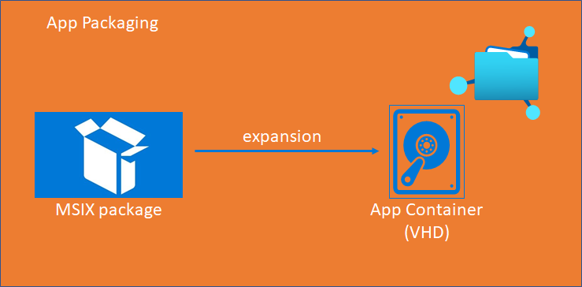
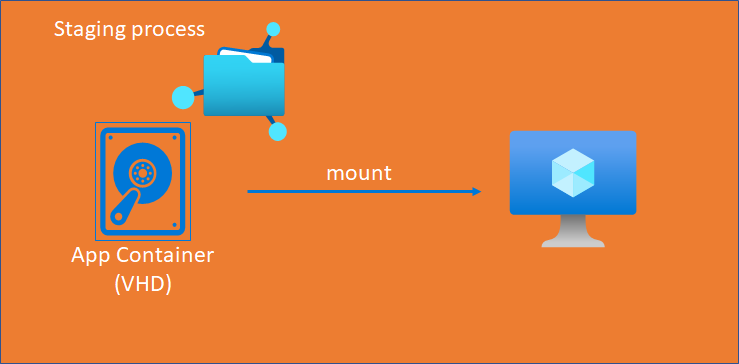

<iframe width="650" height="500" src="https://www.youtube.com/embed/4rPEWSHnDIM?si=n3qf2DWP6pP4xLgl" title="YouTube video player" frameborder="0" allow="accelerometer; autoplay; clipboard-write; encrypted-media; gyroscope; picture-in-picture; web-share" referrerpolicy="strict-origin-when-cross-origin" allowfullscreen></iframe>

First of all a very huge thanks to Christiaan Brinkhoff and Dean Cefola for having me at this awesome event, happened today, the 11.12.2020 in an XXL format! Microsoft Meets Community: Windows Virtual Desktop.

It was an absolute honour to speak for 2000 registered users from the community!

## Chapter 1 – What is MSIX / App Attach?

MSIX is a Windows app package format that provides a modern packaging experience for all Windows applications. Generally, MSIX preserves the functionalities of basic application packages and adds new functionalities for modern application delivery and installation to it. MSIX packages can be used everywhere in your Windows 10 based environments, which makes this format highly flexible for enterprise deployments.

An existing application installer can be used to convert Applications into MSIX packages and to expand them to be used in MSIX App Attach – Microsoft’s game-changing application delivery model!

### Chapter 1.1 – How is a MSIX package built?

A MSIX package consists usually of the following set of files:


<b> Application Files: </b>
These are the files that represents the application/s itself and the dependencies inside of an MSIX package

<b> AppManifest: </b>
The App Manifest is an XML based document that contains information an OS needs for the deployment, display and update of an MSIX application. This info includes usually identity, package dependency information, required capabilities, visual elements of extensibility points.

The following example represents a screenshot from an opened AppManifest.xml:


<b> AppxBlockMap: </b>
The AppBlockMap is also represented as XML document, which contains a list of the app files along with indexes and cryptographic hashes for each block of data, which is stored inside of the package. The block map is secured by the digital signature used to sign the package itself.

<b> AppxSignature: </b>
To deploy and run apps, they need to be signed first. This can be through a CA (internal or external), or through a Self-Signed Certificate.

<b> App Payload </b>

## Chapter 2 – MSIX App Attach


MSIX App Attach is the new, modern app delivery model of Microsoft, which enables customers to easily deploy their packages MSIX packages in a container, like they’re probably using it already in form of an FSLogix Profile or Office365 container.

The functionality of MSIX App Attach is currently still in preview, but will be definitely one of the game changers in VDI environments, once GA!

To be able to deliver MSIX App Attach containers, the user must work on a Windows 10 2004 version or later, where the MSIX APIs are already built into the OS itself.

You might ask yourself – okay pretty fine, but what are the advantages of using this functionality?

* Less reimaging! Use standard images and capture/expand your applications for delivery via App Attach and store the containers in a central location within your network!
* Same package format across the organization. As you can centrally store the container it can be deployed throughout the complete organizational network. Updates can be applied immediately as needed.
* No repackaging needed – Some vendors already ship their apps as MSIX package
* Apps are indistinguishable from other apps on the OS. You can deploy different versions of one application with different dependencies without impacting the OS, other users, or other apps themselves (e.g. Chrome with certain security settings/extensions)

### Chapter 2.1 – MSIX App Attach Terminology

Now we need to cover, what are the stages we are using to start with MSIX App Attach and what do we exactly need to prepare. Here you can find a summary of tasks and wordings we use, while working with MSIX App Attach:

#### Chapter 2.1.1 – Expand


This is the process where we take a MSIX package and unpack it (expand) it to a VHD container. It will be equipped with the software represented as an MSIX package and simply containerized.

Afterward, we can store this VHD file on a global position within our network. For that make sure that your network share is SMB compatible and the VMs are able to read this location.

#### Chapter 2.1.2 – Stage



The following steps are Powershell scripts, to be executed to make the magic happen! It all starts with the staging process, which is the moment when the VHD/X or CIM file gets mounted on the destination OS. Junctions will be created to stage the application. At this time, the user is not able to see the application yet.

Here you can find an example staging script:

```powershell
#MSIX app attach staging sample
#region variables

$ScriptParentPath = $MyInvocation.MyCommand.Path -replace $myInvocation.MyCommand.Name,""

$vhdSrc = (get-ChildItem -Path $ScriptParentPath -Filter *.vhd)[0].FullName

Write-Host "VHD $vhdSrc found"


$JSONFileName = "AppAttachInfo.json"

$msixJunction = "$Env:Temp\AppAttach\"

#endregion

#region mountvhd

try{
    $VHDFolder = (Get-Item $vhdSrc).DirectoryName
    $JsonFile = "$VHDFolder\$JSONFileName"

    If(Test-Path -Path $JsonFile){
        $Json = get-content $JsonFile |ConvertFrom-Json

        $MountedVHD = Mount-DiskImage -ImagePath $vhdSrc -NoDriveLetter -Access ReadOnly 

        $msixDest = $Json.PartitionPath
        $packageName = $Json.PackageName

        $parentFolder = $Json.ParentFolder
        $parentFolder = "\" + $parentFolder + "\"
    }
    else{
        Write-Host "$JsonFile not found"
    }
}
catch
{
    Write-Host ("Mounting of " + $vhdSrc + " has failed!") -BackgroundColor Red
}

#endregion

#region makelink

if (!(Test-Path $msixJunction)){
    md $msixJunction
}

$msixJunction = $msixJunction + $packageName

cmd.exe /c mklink /j $msixJunction $msixDest

#endregion

#region stage

[Windows.Management.Deployment.PackageManager,Windows.Management.Deployment,ContentType=WindowsRuntime]| Out-Null

Add-Type -AssemblyName System.Runtime.WindowsRuntime

$asTask = ([System.WindowsRuntimeSystemExtensions].GetMethods() | Where {
$_.ToString() -eq 'System.Threading.Tasks.Task`1[TResult] AsTask[TResult,TProgress](Windows.Foundation.IAsyncOperationWithProgress`2[TResult,TProgress])'
})[0]

$asTaskAsyncOperation =
$asTask.MakeGenericMethod([Windows.Management.Deployment.DeploymentResult],
[Windows.Management.Deployment.DeploymentProgress])

$packageManager = [Windows.Management.Deployment.PackageManager]::new()

$path = $msixJunction + $parentFolder + $packageName # needed if we do the pbisigned.vhd

$path = ([System.Uri]$path).AbsoluteUri

$asyncOperation = $packageManager.StagePackageAsync("$path", $null, "StageInPlace")

$task = $asTaskAsyncOperation.Invoke($null, @($asyncOperation))

Do{
    Start-Sleep -Milliseconds  100
}Until(($task.IsCompleted -eq $true) -or ($task.IsFaulted -eq $true))

$task.Exception
$task.Status

#endregion
```

#### Chapter 2.1.3 – Register

From here, the mounted VHD/X or CIM file will be taken and the apps inside this container will be registered to the user’s session. More technically speaking, the MSIX file will be added to the C:\Program Files\WindowsApps\ folder.

Here is an example for the registering script:

```powershell
#MSIX app attach registration sample
#region variables

$ScriptParentPath = $MyInvocation.MyCommand.Path -replace $myInvocation.MyCommand.Name,""

$vhdSrc = (get-ChildItem -Path $ScriptParentPath -Filter *.vhd)[0].FullName

Write-Host "VHD $vhdSrc found"


$JSONFileName = "AppAttachInfo.json"
$VHDFolder = (Get-Item $vhdSrc).DirectoryName
$JsonFile = "$VHDFolder\$JSONFileName"


    If(Test-Path -Path $JsonFile){
        $Json = get-content $JsonFile |ConvertFrom-Json
        $packageName = $Json.PackageName
    }
    else{
        Write-Host "$JsonFile not found"
    }

#endregion

#region register

    $path = "C:\Program Files\WindowsApps\" + $packageName + "\AppxManifest.xml"
    Add-AppxPackage -Path $path -DisableDevelopmentMode -Register


#endregion
```

#### Chapter 2.1.4 – De-Register & De-Staging

These are the steps where the made changes will be reverted from the system. The deregistration will happen and the junction will be deleted. Finally the container gets dismounted from the system.

Here is an example for the de-registering script:

```powershell
#MSIX app attach deregistration sample


#region variables
$ScriptParentPath = $MyInvocation.MyCommand.Path -replace $myInvocation.MyCommand.Name,""

$vhdSrc = (get-ChildItem -Path $ScriptParentPath -Filter *.vhd)[0].FullName

Write-Host "VHD $vhdSrc found"


$JSONFileName = "AppAttachInfo.json"
$VHDFolder = (Get-Item $vhdSrc).DirectoryName
$JsonFile = "$VHDFolder\$JSONFileName"

If(Test-Path -Path $JsonFile){
    $Json = get-content $JsonFile |ConvertFrom-Json
    $packageName = $Json.PackageName
}
else{
    Write-Host "$JsonFile not found"
}


#endregion

#region deregister

Remove-AppxPackage -PreserveRoamableApplicationData $packageName

#endregion
```

And hereafter also an example of the de-staging script:

```powershell
#MSIX app attach de staging sample


#region variables

$ScriptParentPath = $MyInvocation.MyCommand.Path -replace $myInvocation.MyCommand.Name,""

$vhdSrc = (get-ChildItem -Path $ScriptParentPath -Filter *.vhd)[0].FullName

Write-Host "VHD $vhdSrc found"


$JSONFileName = "AppAttachInfo.json"
$VHDFolder = (Get-Item $vhdSrc).DirectoryName
$JsonFile = "$VHDFolder\$JSONFileName"

$msixJunction = "$Env:Temp\AppAttach\"

#endregion


If(Test-Path -Path $JsonFile){
    $Json = get-content $JsonFile |ConvertFrom-Json
    $packageName = $Json.PackageName
    $PackageMountPoint = "$msixJunction\$packageName"
}
else{
    Write-Host "$JsonFile not found"
}


#region deregister

Remove-AppxPackage -AllUsers -Package $packageName

#cd $msixJunction

Remove-Item -Path $PackageMountPoint -Recurse -Force

# rmdir $packageName -Force -Verbose


Dismount-DiskImage -ImagePath $vhdSrc

#endregion
```

#### Chapter 2.1.5 – The PowerShell scripts

The following video shows you how to modify the PowerShell scripts needed to get started with MSIX App Attach. I assume at this stage, that you have a MSIX package ready or prepared earlier. I will go through all scripts starting from the Staging till the Destaging process.

## Chapter 3 – Storage Options for MSIX App Attach

The next question is of course, where to store the containers.

In my slides I’ve presented you with the three major possibilities that are given for Azure workloads:

Azure Files (Premium Tier) / Azure NetApp Files / File Server VM on Azure

The advantages Azure Files provides, is that you can use the Active Directory built in security infrastructure, while using on-prem Security Groups to assign access to the file share. So you don’t need to adapt your environment heavily. Personally I recommend Azure Files for small to medium sized companies, which require less than 4TB storage.

If you require more storage, from 4 TB and beyond I recommend to go for Azure NetApp Files. A service which provides you with a bunch of features and the ultimate performance for larger environments.

Last but not least you can also go for a classical VM on Azure, which acts as a File Server. Keep in mind, you are responsible for the security and maintenance of the machine!

## Chapter 4 – Container Security

Another huge topic is, how does MSIX packages and App Attach for a secure containerization and app delivery?
The schema above represents the signing process of an MSIX package. As you have learned in the session – each MSIX package must be signed to be able to run on a Session Host.

To sign an app you can go for:
* An internal / external CA
* Self-Signed Certificate

The application certificate then must be imported to the destination device / OS to the Computer Certificate Store > Trusted People

Another security bringing capability is, that MSIX App Attach containers will be staged and mounted read-only on a Session Host. This means that an end user is not able to manipulate the application package. On the other hand it implicates that the packager takes care that no malicious software is inside of the package.

## Chapter 5 – Which tools to use for MSIX App Attach?

There are several tools you can use for the packaging, creation of the Powershell scripts etc.

If you need a tool for the packaging itself, you can use the official MSIX Packaging tool from the Microsoft Store: (https://www.microsoft.com/store/productId/9N5LW3JBCXKF)

If you want to know, how the tool works, I invite you to check out one of my latest blog posts which guides you through the installation and packaging of one application: Open Remote App from a started WVD session | WVDLOGIX – Windows Virtual Desktop and FSLogix Blog

Another great tool, which helps you then to automatically create the VHDX including the PowerShell scripts for App Attach is a free tool from Marcel Berger the MSIX Commander. It can be downloaded here: (https://github.com/bergerpascal/MSIX_Commander/releases). 

## Demo: Create an App Attach Container using MSIX Commander

<iframe width="560" height="315" src="https://www.youtube.com/embed/EH3UYFDdceE?si=PvisW1bib-036sJK" title="YouTube video player" frameborder="0" allow="accelerometer; autoplay; clipboard-write; encrypted-media; gyroscope; picture-in-picture; web-share" referrerpolicy="strict-origin-when-cross-origin" allowfullscreen></iframe>

## Chapter 6 – Conclusion

MSIX App Attach will be soon integrated in the Azure Portal, which will be an initiator for a lot of enterprises to test the new and modern app delivery method. This will remove the need of creating and maintaining the PowerShell scripts manually and will clearly streamline the delivery process even more. Additionally, with the CimFS based containers, applications can be even delivered more resource friendly on the Session Host, than with VHD or VHDX containers. I will constantly report about the latest MSIX news in my following blog posts.

Thanks a lot for attending to the event and if you have any question, feel free to reach out to me via Social Media or this blog page! Always happy to help you!

Cheers,

Patrick!
