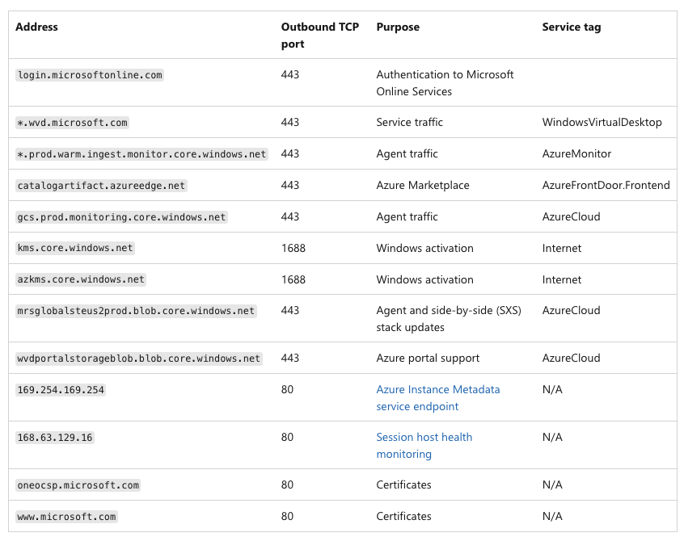

On 16.04.2021 Tom Hickling (https://twitter.com/@tomhickling) announced via LinkedIn, that Microsoft released a tool to validate that Session Hosts can reach the required services to ensure full connectivity to the WVD services.

The tool is built to present you the URLs which are accessible or not, if that’s the case. However there are a few things you need to keep in mind, before running the tool.

In this blog, I will tell you what you must know about the URLs and ports to be opened for WVD, as well as what the required URL check tool can do for not and what it can’t do!

## Which URLs and ports are required for a Session Host to connect to the WVD backplane?

Let’s start with the first question on which URLs and ports you need to open to let your Session Hosts access the WVD backplane. You will see a few URLs with an asterisk (*), or a wildcard in front of the URL, you have to know that the WVD required URL check tool is NOT able to resolve or check against those, so you have to ensure proper connectivity.



## Is there an easier way to enable the required ports if I’m using Azure Firewall?


In case that you’re using Azure Firewall you’re lucky, because Microsoft provides FQDN Tags for Windows Virtual Desktop, which enables the service in just a few clicks. So you don’t need to open the ports / URLs one by one, as you can simply select the service Tag “Windows Virtual Desktop”.

Just navigate to your Azure Firewall and select a Firewall Policy. Here you can find “Application Rules“, create a new rule, and select the IP address range of your WVD Session Hosts or any by typing “*” and select “Destination Type” FQDN Tag. Now you can simply select “WindowsVirtualDesktop” from the dropdown list and click save until you’re ready to go.

## What are the requirements for the WVD required URLs check tool

* WVD Host Pool with deployed Session Hosts (as this script/tool is intended to run from inside the VM)
* .NET 4.6.2 framework must be installed on your Session Host 
* RDAgent version 1.0.2944.400 or higher
* The WVDAgentUrlTool.exe file must be in the same folder as the WVDAgentUrlTool.config file

## How to execute the tool

First you need to open the Powershell and navigate to the RD Infrastructure Agent folder.

```powershell
cd C:\Program Files\Microsoft RDInfra\RDAgent_1.0.2944.1200
```

Now you just need to execute the WVDAgentURLTool.exe and you’ll get the results after a few seconds presented.

```powershell
.\WVDAgentUrlTool.exe
```

As you can see from the results, some URLs from the list above are missing in the tool, therefore it’s mandatory to verify the mentioned required URLs before executing the tool.

## Conclusion

The WVD URL Check Tool is a great way of quickly checking the connectivity to the WVD services for your Session Hosts, but you have to keep in mind that you still have some prerequisites to fullfil before you can trust the result and ensure 100% connectivity to the service.

If you want to know more about the tool or have general questions about WVD connectivity feel free to reach out to me at any time!

Cheers,

Patrick