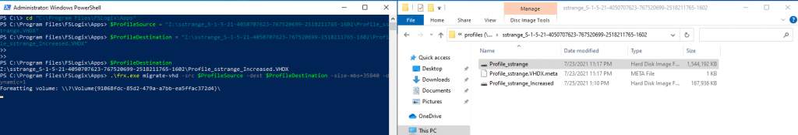
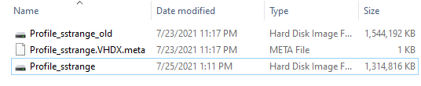

Hi and welcome to my latest blog post about Azure Virtual Desktop and FSLogix v2105.

On the 12th of July, Microsoft announced a new version of FSLogix, which has a bunch of features, that could help you in maintaining your profiles. In this blog post, we will focus on: “How to increase the vhd/vhdx profile size” without the need for PowerShell or any migration of profile data into a new container.

But let’s start with a question that I previously get to show you the real advantage of this new capability.

## What is the default size, and is that not enough for most use cases?

As many of you know, an FSLogix default profile has a maximum size of 30GB per profile disk. For most use cases this should be absolutely sufficient, however, there are quite a few examples, where this isn’t enough (Hotline / HelpDesk workers with a lot of data that needs to be available in the profile and where OneDrive isn’t an option).

So you had two options:
* Consider a right sizing from the beginning and configure the SizeInMB registry / GPO setting accordingly
* Migrate the files to a container with an increased size and migrate the data properly and set the permissions

As you can imagine, both options aren’t really optimal from the administration’s perspective.

## How to I increase the FSLogix Profile size using version 2105?

First, you need to perform the update to version 2105 from your current version. This can easily be achieved by downloading the installer files from Microsoft here.

You just need to install the application and restart the system to apply the update.

<b> Attention! Ensure that no users are logged on the system, while you’re performing the update to avoid data loss. Also, try to not log on with a user, that owns an FSLogix profile otherwise, you risk that your profile is corrupted. </b>

Now you need to follow these easy steps to achieve the profile increasing:

* Connect to your available Domain Controller, where you’re using the FSLogix Administrative Templates (available from the download link above)
* Navigate to the Group Policy Management mmc.
* Create a new Group Policy Object or navigate to your existing one (shown in my example below)


* Perform a right click and click on “Edit”
* Navigate to “Computer Configuration / Administrative Templates / FSLogix / Profile Containers“
* Adjust the setting “Size in MBs” and set it to your preferred value. The increasing of the profile disk will become active, once the user logs on again.


* Once the user logged in, you can verify the change while navigating in your Windows Explorer to: “C:\Program Files\FSLogix\Apps” and open the frxtray.exe to see the current status of the profile.
* Make a double click on the green light, which opens the tool to verify the new maximum profile size.
* As you can see the new profile size has directly been applied.


<b> If I’m not able to upgrade to v2105, how do I increase the profile size with option 2 mentioned above? </b>
If you still need to perform the increasing of the profile disk manually, you have to follow these steps:

* Connect to a session host / virtual machine that has the FSLogix Apps installed
* Navigate to: “C:\Program Files\FSLogix\Apps”
* Collect the actual disk file of the profile that you want to increase. In my example this is a profile located on a storage account, that I’ve mounted using drive letter “Z”. E.g. Z:\sstrange\sstrange.vhdx
* <b> IMPORTANT! Make sure to create a backup of the disk to avoid any corruption that could occur! </b>
* Use the following command to increase the size from 30GB to 35GB:

```powershell
.\frx.exe migrate-vhd -src Z:\sstrange\Profile_sstrange.vhdx -dest Z:\sstrange\Profile_sstrange_increased.vhdx -size-mbs=35840 -dynamic=1
```



<b> ATTENTION! If you might see an error coming up while migrating/increasing the user’s profile that sounds like: </b>

```
Error Mirroring files (0x0000001D): The system cannot write to the specified device.
```

This is most likely due to cache files that couldn’t be copied to the new disk files (most likely coming from Microsoft Edge cache). You can ignore this error for now and continue with the next step.

*  Now you need to rename the profile, now that you have the previous and the new one. This means that you would need to rename Profile_sstrange.vhdx to Profile_sstrange_old.vhdx and Profile_sstrange_increased.vhdx to Profile_sstrange.vhdx. (Apply to your current naming settings defined in FSLogix). The result could look like this:



* Now keep the old profile and advise the user to perform a login test before removing the old profile.
* Once the user logged in, you can verify the change while navigating in your Windows Explorer to: “C:\Program Files\FSLogix\Apps” and open the frxtray.exe to see the current status of the profile.
* Make a double click on the green light, which opens the tool to verify the new maximum profile size.
* As you can see the new profile size has directly been applied.


As you have seen, the new version 2105 with the capability of increasing the profile disk size will help customers a lot. It’s a very streamlined administrative experience that does exactly what it should. The results can be verified and work perfectly with FSLogix Cloud Cache as well!

I can just recommend performing the task via Group Policy if you want to apply the setting at a global scale, rather than doing it via Group Policy.

Nevertheless, there is one remark I want to make in terms of implementing this change. Keep in mind that all users, that have the right to use an FSLogix profile will be targeted with this setting, which leads into problems with your current allocated storage capacity! Make sure to keep your scoping right, or perform the manual way of doing it as stated in chapter “If I’m not able to upgrade to v2105, how do I increase the profile size with option 2 mentioned above?” if that fix should be applied to only a single / bunch of users.

If you have any questions, write them down in the comments and I will try to answer them asap!