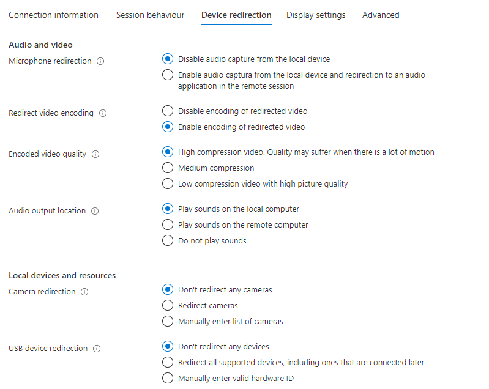
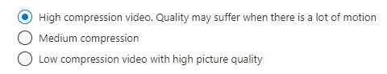
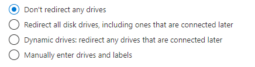
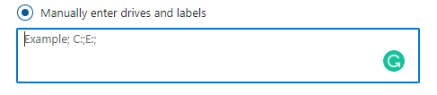
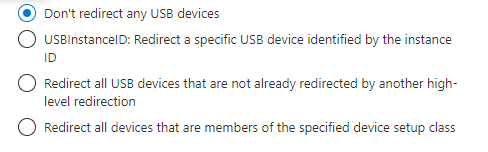
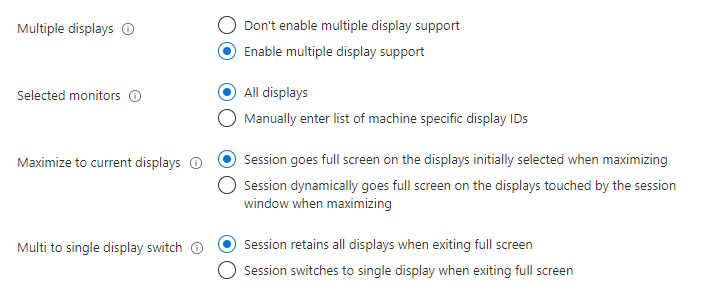

Hi everyone it´s Patrick again with a new article on the RDP properties in Windows Virtual Desktop.

As some of you know, these popped up on the 5th October 2020 again, after a few months of disappearance. Some of you had a lot of questions, especially on the impact these settings have.

The purpose of this article is to give you a general overview of the settings and their impact on the Remote Desktop itself.

If you want to get a general overview of the new RDP settings, please watch the video below and use this guide to help you rock your AVD environment:

## Where to define RDP properties

First of all you can define RDP properties from within the Azure Portal. To find them, simply logon to the Azure Portal on https://portal.azure.com and navigate to the Windows Virtual Desktop service by using the search bar or using the quick link. To find the properties you must have at least one Host Pool in place. This can be created from within the portal or via PowerShell.

Select one of the Host Pools, in my example this is “KCLD-WVD-TestAuto”

Finally click in the menu on the left side on RDP properties to see the options.


You can also define RDP properties via Powershell. Same here, a Host Pool must be present in the current setup.

```powershell
### Variables - Please replace Resource Group and HostPool with your values ###
$RGHP = %Your Resource group for HostPools%
$HPName = %Your HostPool name%

### Install new Spring Release Powershell Module for WVD ###
Install-Module Az.DesktopVirtualization

### Import Module ###
Import-Module Az.DesktopVirtualization

### Login to Azure Account ###
Connect-AzAccount

### Retrieve current settings from HostPool ###
Get-AzWvdHostPool -ResourceGroupName $RGHP -Name $HPName | fl Name,CustomRDPProperty
```

## Connection information


The connection information tab is the first of five to define the RDP properties for the Host Pool. Let me quickly explain you the different values:

Credential Security Support Provider (CredSSP): Identifies whether Remote Desktop will use CredSSP for authentication if it´s available.

For those of you, which doesn´t know what CredSSP is, it can be generally explained as Security Provider that will be used by the Support provider Interface. It helps an application “Remote Desktop Client” e.g. to delegate the user´s credentials from the client to the target server for remote authentication.

Manual setting value: enablecredsspsupport:i:value

<hr>

Reconnection settings: This setting helps administrators to let their users reconnect to their existing session if the session reaches the state disconnected. This can happen when a user logs off or is just closing the window. If you want your users to get a new session, select “initiate a new connection”.

Manual setting value: disableconnectionsharing:i:value

Practical Tip! If you select the initiate a new connection setting, make sure the user will be properly logged off after a certain time limit has reached. Otherwise, the users will flood your environment with multiple logins which make an Auto Scaling logic impossible to apply! This can be reached by applying the Group Policy to enforce the logoff by determining a specific time limit:


```powershell
Computer Configuration / Administrative Templates / Windows Components / Remote Desktop Services / Remote Desktop Session Host / Session Time Limits
```

This is a general tip, regardless of the RDP setting mentioned, it will help your users to properly logoff as well and to avoid issues with the FSLogix profile.

<hr>

Alternate Shell (Path): This setting defines a program to be started automatically ones a new user session has been initiated. It makes sense if you want to enforce a user to use a specific app at the start-up without linking an app to the user´s start-up folder. The path to that application must be defined as local path “C:\ProgramFiles\Office\word.exe” e.g..

Manual setting value: alternate shell:s:value

<hr>

## Session behaviour


Reconnection: Defines, if a client should try to reconnect to a user´s session if the connection gets lost. This can happen when the internet connection is lost, or if there a any other unforeseeable reasons on a network level. You can choose whether you want to PREVENT or ALLOW a client to re-establish a connection.

Recommended: Client automatically tries to reconnect.

Manual setting value: autoreconnection enabled:i:value

<hr>

Bandwidth auto detect: Determines whether automatic network type detection is enabled or disabled. It helps to identify the currently available bandwidth. This setting correlates with the next setting “Network Auto Detect”

Recommended: Enable automatic network type detection

Manual setting value: bandwidthautodetect:i:value

<hr>

Network auto detect: Determines whether to use automatic network bandwidth detection or not. Requires the previous option to be set.
Attention: Connection type 7 is required.

Generally, these settings can be defined as well in a RDP file. We distinguish between the following modes on-premises:

1 – Modem (56 Kbps).
2 – Low-speed broadband (256 Kbps – 2 Mbps).
3 – Satellite (2 Mbps – 16 Mbps with high latency).
4 – High-speed broadband (2 Mbps – 10 Mbps).
5 – WAN (10 Mbps or higher with high latency).
6 – LAN (10 Mbps or higher).
7 – Automatic bandwidth detection – REQUIRES bandwidthautodetect

The setting itself, doesn´t do anything, when set. It becomes active, when select in the RDC GUI and changes automatically several performance related settings such as: Themes, Font Smoothing, Aminations etc.

Recommended: Use automatic network bandwidth detection.

Manual setting value: networkautodetect:i:value

<hr>

Compression: Determines whether bulk compression is enabled when it is transmitted by RDP to the local computer.

This setting was first introduced in the RDP6 protocol and has helped in reducing the RDP network bandwidth significantly. In some cases you might want to disable this setting, as there are already mechanisms by your network vendors (e.g. Cisco Wide Area Application Services), where compression occurs problems. This must be identified together with your networking team.

Recommendation: Enable RDP bulk compression.

Manual setting value: compression:i:value

<hr>

Video playback: Determines if the connection will use RDP-efficient multimedia streaming for video playback.

This setting has been first introduced in July 2009, where improvements have been made to optimize the overall video playback experience for Win7 and Win2008 R2 servers. Technically it means, that the client (endpoint) will receive the original compressed multimedia stream from the RDP server / WVD Session Host and decode it on the local hardware for displaying. This is also an improvement of the network bandwidth, as the data will be received compressed on the endpoint.

Recommendation: Use RDP-efficient multimedia streaming for video playback when possible.

Manual setting value: videoplaybackmode:i:value

## Device redirection



Microphone redirection: Lets you decide if you want to redirect audio capturing devices from you local endpoint to the remote session. Required for video conferencing tools as Webcams with Mics and other microphones will not work.

Recommendation: Enable audio capture from the local device and redirection to an audio application in the remote session

Manual setting value: audiocapturemode:i:value

<hr>

Redirect video encoding: Enables or disables the video encoding on the local endpoint for the RDP session.

Recommendation: Enable encoding of redirected video.

Manual setting value: encode redirected video capture:i:value

<hr>

Encoded video quality: Helps to define how much a video will be compressed for the remote session. You have the following options with the impacts:



Manual setting value: encode redirected video capture encoding quality:i:value

<hr>

Audio output location: Defines, where audio will be played while being connected to the remote session. You can decide between the following options:


Recommendation: Play sounds on the local computer

Manual setting value: audiomode:i:value

<hr>

Camera redirection: Helps to define, if cameras / webcams can be redirected to the remote session from the local endpoint. You can redirect all cameras, or define manually a list of cameras to be redirected. Important! The redirection of the camera is mandatory for the usage of video conferencing tools such as Teams.

Recommendation (simplified): Redirect cameras.

Manual setting value: camerastoredirect:s:value

<hr>

USB device redirection: Helps to define, if and which USB devices shall be redirected to the remote session host from the local endpoint. You can define, whether you want to decline any redirected USB devices, redirect all supported drives including later connected ones or to manually enter the list of USB devices while using the hardware ID.

Recommendation (simplified): Redirect all USB drives
Attention! Redirecting all USB drives is just a very simplified option! For security I don´t recommend this setting as any foreign USB key with potential malware on it can be plugged and being redirected to the remote session. Please evaluate this setting from case to case!

Manual setting value: devicestoredirect:s:value

<hr>

Drive/storage redirection: Determines, which local drives shall be redirected to the remote session. The following options are available:



The options are nearly self-explaining. You can decide to redirect all drives, also those attached at a later time. You allow only drives, connected after the remote session has been established, or you define manually the drives and labels to be redirected.

Recommendation: Depends on the security needs! Be aware that redirecting all drives is a potential security risk for your environment.

If you want to manually allow the redirection, you can define this by defining the drive letter e.g.:



Manual setting value: drivestoredirect:s:value

<hr>

Clipboard redirection: Determines if the local clipboard from the local endpoint shall be redirected to the remote session. You can define if you want to allow it or block it.

Recommendation: Depends on the security you want to provide. If somebody writes her / his password in cleartext in a text field and just copies it, it could be potentially captured. Be cautious!

Manual setting value: redirectclipboard:i:value

<hr>

COM ports redirection: Determines if you want to redirect serial connections from your local endpoint to the remote session. Might be useable for legacy devices.

Recommendations: COM ports are not available in the remote session. Depends on the case.

Manual setting value: redirectcomports:i:value

<hr>

Printer redirection: This setting lets the local printers being redirected to the remote session from the local endpoint. This might be helpful for your end-users in home office scenarios, where printing is essential. You can decide whether you want to allow or decline the connection.

Recommendation: Depends on the security. Printing out confidential documents might be a potential risk. This can also be protected by Windows security mechanisms like Information Protection, but if those features are not in place, printing could be declined.

Manual setting value: redirectprinters:i:value

<hr>

Smart card redirection: Determines, whether you want to allow Smartcard redirection or not. Smartcards generally help to authenticate against a specific service. This can be useful especially for Middleware’s connecting to financial software, or the local authentication on the Session host.

Recommendation: The smart card device on the local computer is available in the remote session.

Manual setting value: redirectsmartcards:i:value

<hr>

USB redirection: Helps to define more granularly, which kind and type of USB device shall be redirected to the remote session. Compared to the other settings above, you can decide to allow or decline the following settings:



Manual setting value: usbdevicestoredirect:s:value

## Display settings

Multiple displays: Determines if the remote session supports all displays or just a single display. If Enabled, you can select, whether all monitors should be used by default, or if you want to enter a list of display IDs to allow only these monitors. Additionally, you can define the maximizing behavior for these screens, as well as a Multi to single display switch, which helps to switch from a multi-screen to single screen, when the full screen mode has been ended.



Recommendation: Enable multiple display support

Manual setting value: use multimon:i:value

<hr>

Screen mode: Determines whether the remote session will appear in a windowed or full screen mode.

Recommendation: The remote session will appear full screen.

Manual setting value: screen mode id:i:value

<hr>

Smart sizing: Helps to scale the remote content in the remote session to fit to the size of the monitor. This will automatically adapt the resolution on the remote host. You can decide if you want to allow the scaling in case of resizing or not.

Recommendation: The local window content will scale when resized.

Manual setting value: smart sizing:i:value

<hr>

Dynamic resolution: Will define if the remote resolution will be adopted automatically, when sizing occurs. You can define if you want to keep the same resolution even if the size changes, or you can select a resolution update to the local windows resize and define the scaling factors:


Recommendation: Session resolution updates as the local window resizes.

Manual setting value: dynamic resolution:i:value
desktop size id:i:value | desktopheight:i:value | desktopwidth:i:value | desktopscalefactor:i:value

## Advanced

The advanced tab represents the option previously available, where you can define all the settings mentioned above while using the parameters.

All available parameters are available from the official Microsoft page, (https://docs.microsoft.com/en-us/windows-server/remote/remote-desktop-services/clients/rdp-files?context=/azure/virtual-desktop/context/context), or from the setting explanations above. To easily migrate these settings, just copy and paste the defined settings from the advanced settings once defined and paste them to another Host Pool if needed.

## Conclusion

I hope this article will help you to understand all of the available options for Windows Virtual Desktop more in depth and are a good guidance for your decision. Keep in mind, that the settings might change over time and that all of my recommendations are based on simple environments. Organizations with advanced security requirements, should consider using the manual way of allowing certain device redirection features, over allowing all devices automatically being redirected.

If you like my article, please share it, recommend it or leave a reply below!

Looking forward to hear from you!
Cheers,

Patrick