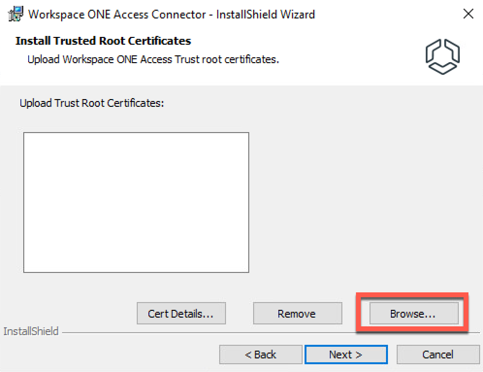
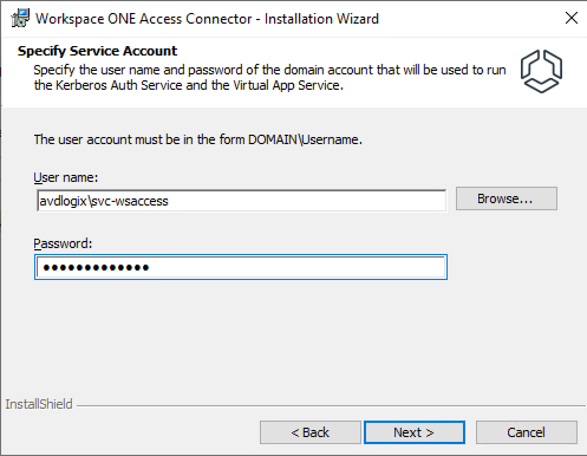

+++
title = "Workspace ONE Access 22.09 – Integration with Horizon On-Premises"
image = "title.png"
date = 2023-01-25T16:56:47+06:00
draft = false
author = "Patrick Koehler"
tags = ["VMware Horizon","Horizon Cloud", "Workspace ONE", "Workspace ONE Access", "IdP"]
categories = ["Horizon Cloud", "Microsoft Azure", "VMware"]
description = "In this segment (Part 4/5) of the series, integrate Horizon assignments with Workspace ONE Access, enabling authentication redirection. Configure SAML authentication on the Horizon Connection Server(s) and set up the Workspace ONE Access Connector appliance to synchronize entitlements."
+++

Welcome to part 4 (actually 5) of the series on how to integrate Workspace ONE Access with Microsoft Azure and Horizon resources on-premises and in the Azure cloud.

In this smaller part of the series, we’re highlighting the integration of Horizon (on-premises) assignments to Workspace ONE Access, including the capability of using the Workspace ONE mode, which is a dedicated mode to redirect the authentication for all Horizon sign ins to Workspace ONE Access.

## Enabling SAML authentication on the Horizon Connection Server(s)
As I’m working in a smaller lab environment, I only have one Connection Server hosted on-premises. However, the following steps must be repeated for every server in your on-premises environment.

Before we can actually start to synchronise our assignments, we must ensure that Horizon and Workspace ONE Access speak “the same language”, which in this case is the usage of SAML authentication, which must first be configured on the Connection Server level.

Open up your preferred browser and navigate to your Administration console of the Horizon Connection Server. Then navigate to Settings > Servers > Connection Servers (tab).

Now highlight the Connection server, for which you want to enable SAML authentication and click on the Edit button above.

Up next, we see a new pop up opening and navigate to Authentication, where we switch the Delegation of authentication to VMware Horizon (SAML 2.0 Authenticator) from Disallowed to Allowed. To configure the SAML authenticators, select Manage SAML Authenticators below.

On the following screen, proceed by clicking Add. Now you must provide the information matching the Workspace ONE Access environment. The value Label is only an identifier for administrative purposes. The important part is the Metadata URL which must match your internally and externally reachable domain. In my case this is https://access.avdlogix.com/SAAS/API/1.0/metadata.idp.xml. As shown in the screen below. When all the settings have been corrected, apply by clicking “OK”.

Confirm the configuration to proceed with the next step.

### Configuring the Workspace ONE Access Connector appliance for entitlement synchronisation

An important step which is often overseen is the reconfiguration / import of the certificate of the Connection server into the Workspace ONE Access Connector appliance. This will be required to trust the certificate used by the Connection Server, when establishing a secure connection.

To apply the configuration I make sure to connect to the Access Connector VM we’ve created in the previous parts, download the certificate from the Horizon Connection Server and go to Control Panel > Programs > Programs and Features and click Change on the Workspace ONE Access Connector installer.

Confirm by clicking Add / Remove Services and click on Next >.

On the next page, the installer allows you to adjust the installation services. Make sure that Virtual App Service is installed before proceeding by clicking Next >.

If you are using a Proxy or Syslog server, you have the change to configure it at the next following pages, if this isn’t the case proceed (and also skip the Citrix configuration part), until you reach the point “Trust Root Certificates”.

On this screen click browse and select the Horizon Connection Server certificate.

Once you’ve selected the certificates, you can validate that they’re correctly recognized by the installer by clicking “Cert Details..”. If the certificates have been imported correctly, proceed by clicking Next >.

Proceed over the next pages by clicking Next >. Stop at the Servic Account level, where you have to provide your credentials again for the Sync service.

Confirm by clicking the check box on “Do you want to restart already installed services and complete this task by clicking Install.

