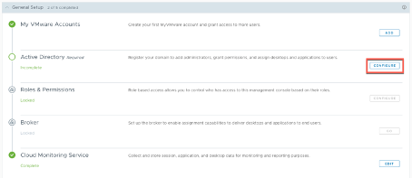
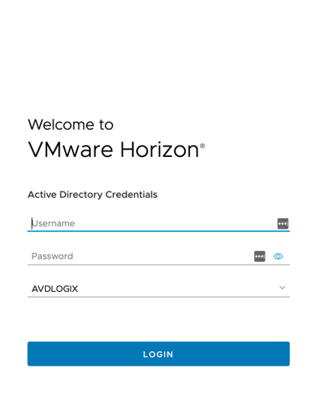

+++
title = "Mastering VMware Horizon Cloud on Azure – Configuring Active Directory and Broker"
image = "title.png"
date = 2023-03-27T16:56:47+06:00
draft = false
author = "Patrick Koehler"
tags = ["VMware Horizon","Horizon Cloud"]
categories = ["Horizon Cloud", "Microsoft Azure", "VMware"]
+++

Welcome back everyone to the next chapter of the Mastering Horizon Cloud on Azure article series. 
In the past articles, I have shown you how to setup the Azure subscription, Resource Groups, networks and accounts as well as the creation of the first POD infrastructure on Azure. 
In this article, we’re going to complete the setup by enabling the infrastructure to authenticate to the domain controller, that you should have in place on Azure or on-premises. In addition to that we will configure the Broker and will enable monitoring. 

## Configure Active Directory

To allow our users with a familar experience, we need to ensure that we bind our Active Directory domain to the Horizon POD. This allows us to entitle users to consume the desktop services that we will provision at a later time. 
After signing in to the Horizon Universal Console using: https://cloud-de.horizon.vmware.com/
We will be back in the Getting Started guide, where we left of in the previous chapter. 

In this chapter we will primarely focus on working on the second tab, which we will need to expand to complete the general setup. To configure the Active Directory connection, we need to click on “Configure” on the right hand site of Active Directory. 

In order to bind the Horizon POD to the domain the following information must be filled out prior clicking on “Domain Bind”. 

NetBIOS Name: NetBIOS name of your domain. E.g. avdlogix
DNS Doman Name: Full DNS name of your domain. E.g. avdlogix.com 
Protocol: LDAP (by default)
Bind username: A service account that you should create upfront in your AD. E.g. horizonadmin
Bind password: The corresponding password to the horizonadmin account.
Auxiliary Account Bind username: An alternative service account for Horizon. E.g. svc_horizon 
Bind password: The corresponding password
Port: 389 (LDAP) or 636 (LDAPS) are supported
Domain Controller IP: In case that the name cannot be resolved the DC can be contacted by IP 
Context: Search context within the domain

Once all the settings have been made, click on “Domain Bind” to perform the operation. 
On the following page, you have to provide the information about the DNS server and the default OU you want VMs to join in. Provide the information that are right for your environment and finalize the setup by clicking on “Save”.

Finally, provide information about the Horizon Admins that you want to enable in your environment. The picture below shows Domain Admins, I highly recommend to choose another group over domain admins, but just wanted to point this out. 

Click on “Save” to finalize the setup. Afterwards you get signed out by the Horizon Universal Console and log back in using first the VMware Account followed by an Admin Account from the group that we have just defined. 

After a successful sign-in you will be welcomed by the VMware Universal Console dashboard.