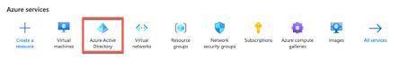
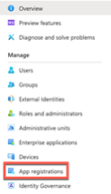
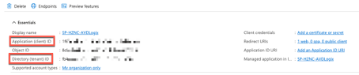
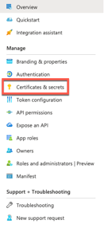
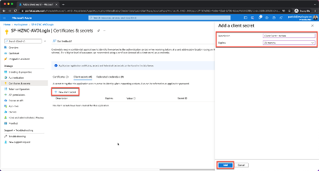

+++
title = "Mastering VMware Horizon Cloud on Azure - Configuring UAG Setup"
date = 2023-03-27T16:56:47+06:00
draft = false
author = "Patrick Koehler"

tags = [
    "VMware Horizon",
    "Horizon Cloud on Azure",
    "Azure",
    "VMware",
    "EUC"
]
categories = ["Horizon Cloud", "Azure", "VMware", "Article Series"]
image = "title.png"
+++

Welcome back to my article series on VMware Horizon Cloud on Microsoft Azure. In the previous articles, we have learned what is needed to prepare the infrastructure to be able to enroll new virtual desktop via the VMware Universal Console. We went through the initial Azure configuration and had a look on how to prepare the certificate for the UAG setup, which we will complete in this tutorial. 
If you missed my previous articles, please find them hereafter:
In this article, I will walk you through the configuration settings to enroll our first cloud based POD on Microsoft Azure.
Table of Contents
Prepare a Service Principal for the VMware Universal Console
Before we can start to configure the Universal Console and create the core infrastructure, we need to ensure that we equip our account with administrative privileges in a secure way. For that reason we require to have a Service Principal in place that provides the console with the necessary rights in our tenant, while ensuring that no passwords are exchanged in clear text. 
To do so, please login to the Azure portal via https://portal.azure.com and select Azure Active Directory.
 

In the following window, we need to select App registrations to be able to create our Service Account. 
 

Once, we entered the App registrations view, click on “+ New registration” in the top center of the screen.  
 

Now we can provide our Service Principal a random name that we want to assign, in my case I name the principal based on the naming convention from the previous article. Make sure to change the Redirect URI to “Web” and provide the URL “http://localhost:8000“. Once we provided the information, click on “Register” to complete the creation. 
Name: SP-HZNC-AVDLogix
Redirect URI: Web
URI: http://localhost:8000

 
Attention! Once the Service Principal has been create make sure to copy the following information and store them in a safe location, as you will need them for later.

Copy the application (client) ID and Directory ID (Azure AD tenant ID)

 
 
Once you noted down the information, we navigate to “Certificates & secrets” on the left hand side to generate the required secret. 
 
 

In here we need to click on “+ New client secret” and provide a client secret description, which is “Client Secret Horizon” in my case and we set the duration to “24 months“. You can also choose a lower time, before the secret expires, but you have to keep in mind to regenerate the secret and update the Universal Console to not lose access or control over the resources. 

 

Attention! Please make sure to copy the Secret Value once you see it, because it will only appear once like this. In case that you missed to copy it, you need to regenerate the client secret. 
  
  

Create a Custom Role for Service Principal (Least Privileges)
Now we are nearly finished with our Service Principal creation, but need to equip it with the required permissions in order to perform tasks in our environment. While doing this we have two options. First, we can assign Contributor rights to our new Service Principal on our subscription, which provides quite a lot of permissions, which we might don’t want if we want to follow the principal of least permissions. 

I recommend creating a custom role, with only the required rights, the Service Principal needs on our subscription. I found an article on the VMware KB, stating the creation of the custom role, which unfortunately doesn’t work for my tenant, for that reason, I’m sharing with you the steps that worked out for me. 
To do so, we switch to the Subscription menu in our Azure tenant, while searching for “Subscriptions” or selecting it from the portal menu. 

Now, we switch to the Access control (IAM) menu on the left hand side, clicking on “+ Add” and selecting “Add custom role” as the following step. 
 

Now we need to provide the name for our custom role, I called mine “CR-AVDLogix-HorizonCloudAzure“. Select “Start from scratch” as the Baseline permission and continue to the “JSON” tab by clicking “Next” two times or by directly clicking on “JSON“
 

In the JSON menu, click the edit button on the right hand side, and navigate to the “Actions”: section, where you have to paste the following code, with the named permissions required.
