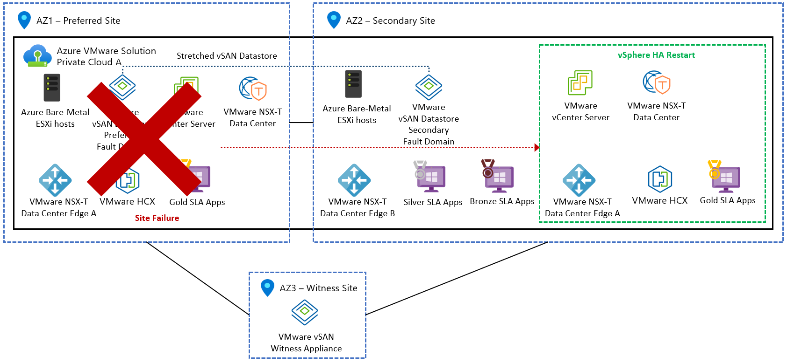

+++
title = "Mastering Azure VMware Solution - Stretched clusters explained"
date = 2024-05-02T19:23:47+06:00
draft = false
author = "Patrick Koehler"

tags = [
    "Azure VMware Solution",
    "Azure",
    "VMware"
]
categories = ["Microsoft Azure", "VMware"]
image = "title.png"
description = "I explore how Stretched Clusters work in Azure VMware Solution. In addition to the functional aspects I give recommendations to be considered in a design phase. This chapter can be seen as an extension to my previous blog post."
+++

Welcome back to my article series on Azure VMware Solution! 
As we covered the general architectural components last time, we want to take a special round around a feature that comes especially handy when you must ensure the high reliability and availability of the AVS infrastructure. Recently I was delving deeper into Azure VMware Solutions Stretched Clusters and want to give you more information and what it is, and what needs to be considered in this blog!

## Azure Availability overview
Let me break it down for you. 
* Azure’s infrastructure is organized into Regions, each catering to specific geographical areas. 
* Within these regions, Azure erects isolated and redundant islands of infrastructure called Availability Zones (AZs). 
* These AZs act as boundaries for resource management, ensuring that failures in one AZ don't cascade into others.

Now, enter Azure VMware Solution, a game-changer for deploying VMware workloads seamlessly on Azure infrastructure. Traditionally, ESXi hosts in an AVS vSphere cluster reside in a single Azure Availability Zone, shielded by vSphere high availability (HA). However, this setup lacks protection against Availability Zone failures. That's where the concept of Stretched Clusters comes into play.

Picture this: a vSAN cluster spanning two separate AZs, aptly named a vSAN Stretched Cluster. By extending across AZs, this setup bolsters application availability and introduces a zero recovery point objective (RPO) capability for enterprise applications without overhauling the design or resorting to expensive disaster recovery solutions.

What's impressive about Stretched Clusters is their resilience to AZ failures, offering a robust private cloud infrastructure with a staggering <b>99.99% availability</b>. This frees you from worrying about infrastructure availability, allowing you to focus squarely on their core application needs.

## How does AVS Stretched Clusters work?

 Let's dive a bit deeper. Stretched Clusters employ vSAN Fault Domains across two AZs, with a managed vSAN Witness in a third AZ to monitor site health and prevent split-brain scenarios. In the event of an AZ failure, vSphere HA steps in, seamlessly restarting virtual machines in the unaffected AZ, ensuring uninterrupted service delivery.

However, it's essential to grasp that Stretched Clusters aren't a panacea for all failure scenarios. While they shield against single AZ failures, they may falter in the face of double or progressive failures. Rare occurrences like inter-AZ failures leading to partitioning demand a comprehensive disaster recovery strategy beyond the scope of Stretched Clusters.

Moreover, Stretched Clusters come with certain limitations and considerations. They necessitate a minimum of six nodes deployed across AZs, adhere to specific storage policies, and rely on vSphere HA for restarts and replication, influencing recovery time objectives (RTOs).

## In which regions are AVS Stretched Clusters available?

Microsoft is currently providing Stretched Clusters in the following regions (last updated 02.05.2024): 

* UK South (on AV36, and AV36P)
* West Europe (on AV36, and AV36P)
* Germany West Central (on AV36, and AV36P)
* Australia East (on AV36P)
* East US (on AV36P)

## Important notice on storage policies

The following SPBM policies are supported with a PFTT of "Dual Site Mirroring" and SFTT of "RAID 1 (Mirroring)" enabled as the default policies for the cluster:

* Site disaster tolerance settings (PFTT):
    * Dual site mirroring
    * None - keep data on preferred
    *None - keep data on nonpreferred

* Local failures to tolerate (SFTT):
    * 1 failure – RAID 1 (Mirroring)
    * 1 failure – RAID 5 (Erasure coding), requires a minimum of four hosts in each AZ
    * 2 failures – RAID 1 (Mirroring)
    * 2 failures – RAID 6 (Erasure coding), requires a minimum of six hosts in each AZ
    * 3 failures – RAID 1 (Mirroring)

## Conclusion

AVS Stretched Clusters are fantastic in order to ensure a high availability of the cloud based infrastructure. However it's important to mention that this high availability comes with a high cost as the nodes must be doubled accordingly (as a minimum of 6 nodes is required for such a scenario). From my perspective I always recommend thinking about the criticality of applications running on this infrastructure before booking the serive / configuring the Stretched Clusters to avoid an overspend in certain scenarios (DR DC for High Availability purposes). 

Again, whenever you have a question, feel free to reach out!

Cheers,
Patrick