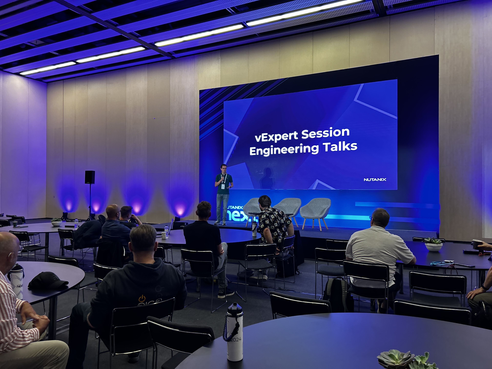

+++
title = ".Next 2024 impressions and recap"
date = 2024-05-27T08:00:47+06:00
draft = false
author = "Patrick Koehler"

tags = [
    "Nutanix",
    "VMware",
    "Microsoft Azure"
]
categories = ["Nutanix"]
image = "title.png"
description = "A quick review about the incredible time of attending Nutanix Next 2024 in Barcelona and meeting a lot of community friends."
+++

Last week I got the chance to attend Nutanix .Next 2024, the annual Nutanix conference that took place in beautiful Barcelona, Spain last week. This was very special for me, not only because it was my very first time in Barcelona, but also because it's a rare occasion for Nutanix employees in Professional Services to attend a conference. 

## The community iniative

But I was there for a special reason, because me and the team built a unique community initiative for current VMware vExperts to get to know Nutanix and their software stack, while learning from the best minds in the company and having the chance to meet the CTO and the engineering team, which was a huge success. 

In addition to the community building, I met a lot of industry experts and friends, which I haven't seen in a while and this was one of the primary take aways that proof how strong our community really is! 

## Personal highlights and reflection

 An absolute highlight was meeting CEO Rajiv Ramaswami. This happened immediately after the Keynote on day 1. Me and my friends saw him, sitting closely to us and we just wanted to take the opportunity to say hallo and thanks for having us sharing our feedback on the technology. 

Another highlight of mine was seeing Sebastian Vettel, 4x Formula 1 champion speaking about sustainability and diversity on stage. 

All in all I can say that I had a fun time and am excited on where Nutanix continues their journey. Personally, I'm also looking forward where the vExpert initiative leads to and how Nutanix is going to expand the program with even more valuable feedback opportunities for the Technologists of our industry.

## Conclusion

I want to conclude this blog with a thank you to my friends and team mates Carmen, Dinah, Chris and Bas. Without them it would have never been possible to make this event for our vExperts possible. In addition, I want to say a HUGE THANK YOU, to the community for being open minded, honest (as always), and eagerness to learn more! See you maybe next year?! 